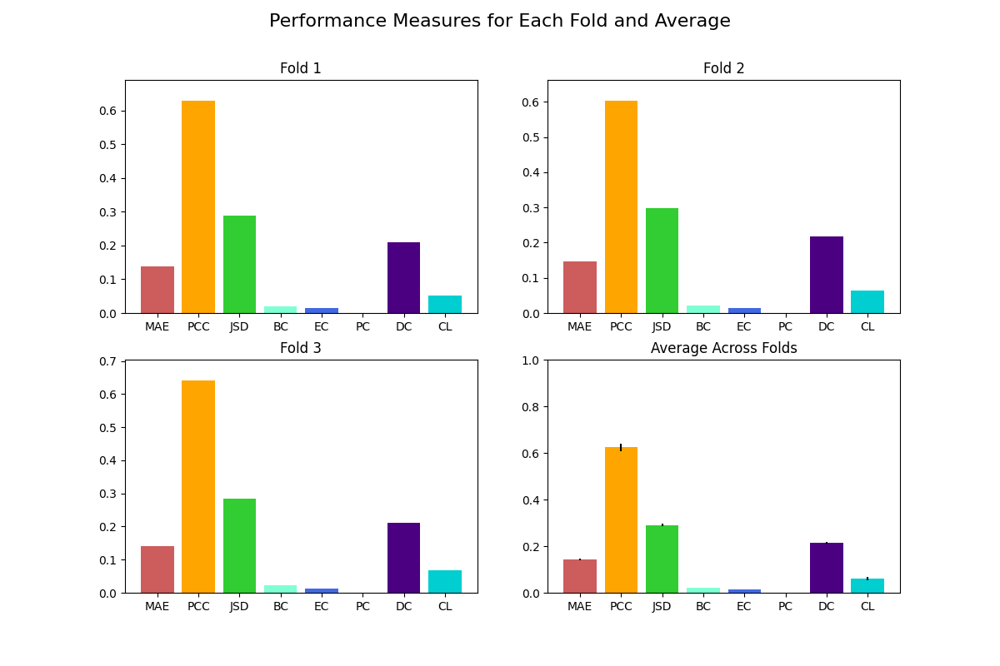

# DGL2024 Brain Graph Super-Resolution Challenge

## Contributors

- Kevin Mancini
- Angelos Ragkousis
- Adam Tlemsani
- Kyveli Tsioli
- Mikolaj Deja

## Problem Description

- TODO Add the problem description as a summary from the report

## GUS-GAN - Methodology

- TODO Add the methodology from the report

- TODO add Figure of your model.

## Used External Libraries

- PyTorch
- PyTorch Geometric

To install the required libraries, run the following command:

```bash
virtualenv venv
source venv/bin/activate
pip install -r requirements.txt
```

To run the code, one should execute the 'main.py' file. There is also a hyperparameter search file, 'hyperparam.py',
that can be used to find the best hyperparameters for the model. It uses `wandb` to log the results of the
hyperparameter. Note that the `wandb` api key should be set at the top of the file.

We do not recommend running the hyperparameter search or the training locally, as it is very time-consuming. Instead, we
used the GPU cluster provided by the university.

## Results

We evaluated robustness and generalisation of our model using 3-fold Cross Validation. Employing a range of performance
metrics including Mean Absolute Error (MAE), Pearson Correlation Coefficient (PCC), Jensen-Shannon Distance (JSD), as
well as the MAE of various centrality measures such as Betweenness, Eigenvector, PageRank, Closeness, and Degree
centrality, we managed to assess the topological accuracy of our super-resolved graphs.
The figure below provides an evaluation of the topological soundness of the generated HR graphs. In
particular, the model shows consistent performance in terms of all metrics across all folds. In more detail, consistent
JSD values across folds imply that the probability distributions of the predicted and ground truth graphs remain
similar, showcasing the model's ability to preserve the underlying distributional characteristics of the brain graphs.
The centrality measures show very slight variations across the folds, but values largely remain consistent, proving that
our model adequately preserves key topological features ensuring that the structural and functional significance of
nodes in the super-resolved graphs "mirrors" that of the ground truth. With an average MAE of 0.14106, our findings
indicate a high fidelity in the generated high-resolution graphs relative to the ground truth.

The total training time for the 3-fold cross-validation was approximately 94 minutes, with a RAM usage of approximately
1.63 GB, which indicate a moderate computational demand. Given that the task of graph super-resolution inherently
requires handling high-dimensional data (non-Euclidean), these numbers suggest that the model is reasonably efficient.
Our Kaggle score is 0.1317, and we ranked 11th across 37 groups.



## References

- The model that served as a starting point for our implementation is the AGSRNet from
  M. Isallari and I. Rekik. Brain graph super-resolution using adversarial graph neural network with application to
  functional brain connectivity. _Medical Image Analysis_, 71:102084, 2021. The code was adapted from the original
  implementation available at https://github.com/basiralab/AGSRNet.
- The convolutional layer used in our model is the SSGConv
  from [pytorch_geometric.nn.conv.SSGConv](https://pytorch-geometric.readthedocs.io/en/latest/generated/torch_geometric.nn.conv.SSGConv.html?highlight=ssg#torch_geometric.nn.conv.SSGConv)
  and the U-Net is
  from [torch_geometric.nn.models.GraphUNet](https://pytorch-geometric.readthedocs.io/en/latest/generated/torch_geometric.nn.models.GraphUNet.html#torch_geometric.nn.models.GraphUNet).